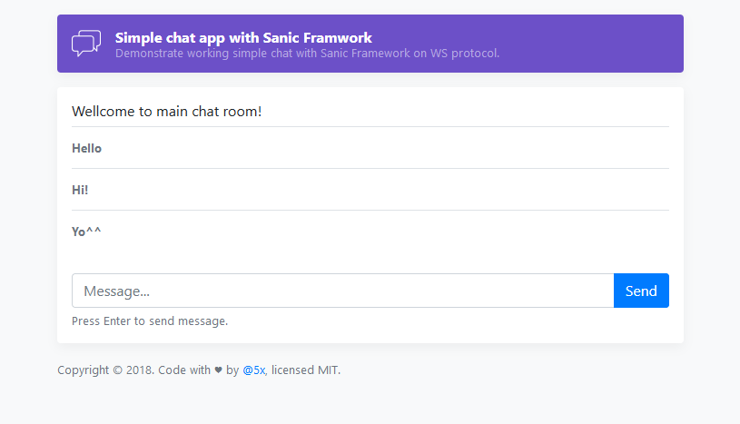

# sanic-simple-ws-chat

Demonstrate simple chat with Sanic Framework on WS protocol.


## Requirements

* Python 3.5 or later
* Sanic 0.7 or highter


## Building with Docker 

To build Docker images use next:
```bash
docker build -t sanic-simple-ws-chat .
```

To run created images by tag name:
```bash
docker run -t -p 8000:8000 sanic-simple-ws-chat
```
[More info about Docker](https://docs.docker.com/)


## Web interface screenshots



## License

The code is available under the [MIT license](LICENSE).
